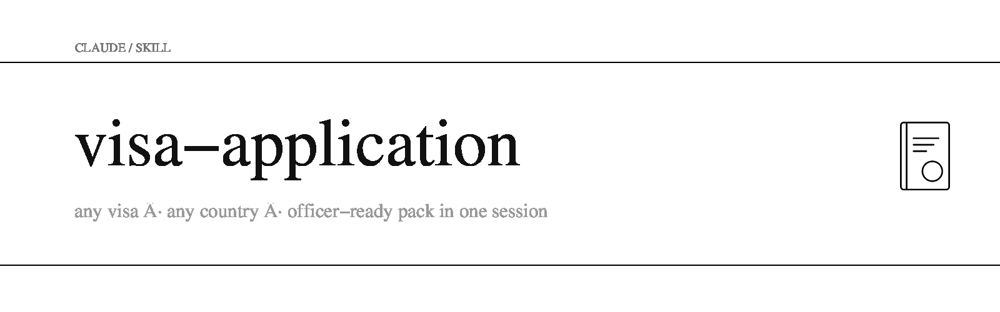

<p align="center">
  
</p>

A Claude Code skill that takes you from *"I need a visa"* to a printed, officer-ready document pack — without spending a week reading consulate websites that contradict each other.

## What it solves

Visa applications are fiddly and high-stakes. Rules drift quarterly. Half the third-party guides on Google are recycling 2019 information. The consulate site is two clicks deep and three years stale. Forgetting one document means a wasted appointment slot and another month of waiting.

This skill standardises the workflow so your time goes into the things only you can do — booking flights, signing letters, getting biometric photos — instead of cross-referencing four sites trying to figure out what €120/day actually means for a 5-day trip.

## How it works

```
   YOU                            SKILL
   ───                            ─────

   "I need a Schengen visa
    to Italy from the UK."   ──▶  4 quick questions: dest / origin / type / dates

                                  Searches your machine for an existing profile.
   Profile found / built  ◀───    First time? Builds it as you go. Reusable forever.

   Drop in passport, payslip,     Reads, OCRs, files, cross-checks against profile.
   hotel booking, bank stmt  ──▶  Updates the profile with anything new.

                                  Researches CURRENT requirements online.
                                  Cross-validates against ≥2 official sources.
   Research summary       ◀───    Surfaces disagreements instead of hiding them.

                                  Generates: cover letter PDF, employment letter
                                  draft, application form (via online portal if
   Document pack          ◀───    one exists, with 2D barcode), checklist PDF.

                                  Assembles numbered Print Pack folder in officer
   "Print, sign, walk in"  ◀───   flip-order. Profile saved for next time.
```

## Features

- **Four-question kickoff.** Destination, origin country, visa type, dates. That's it before research starts.
- **Reusable user profile** at `~/.claude/visa-profile.json`. Identity, passport, employer, banking, prior visas — captured once, replayed for every future application.
- **Drop-and-go document intake.** Paste a passport scan, payslip, bank statement, hotel booking or flight reservation — the skill reads it, extracts the fields, cross-checks against the profile, and files it into the application folder under a clean name.
- **Searches before it creates.** Looks for an existing profile and existing application folder on your machine before assuming you need new ones. No clutter, no duplicates.
- **Research cross-validated against ≥2 sources** every time. Consulate page first, visa-centre operator second, recent guides as sanity check. Source disagreements get surfaced.
- **Generates the document pack** — cover letter PDF, employment letter draft for your manager to sign, application form (filled via the destination's online portal where one exists, complete with 2D-barcode output), and a one-page checklist PDF.
- **Numbered Print Pack folder.** Officer-flip order, clear filenames, ready to print on A4 and walk in.
- **Knows the gotchas.** EES at the Schengen border, UK eVisas replacing BRPs, biometric 59-month reuse, Italy going digital on 1 June 2026, hotel bookings showing two guests when you're solo, dates one day short — all the small things that derail real applications.
- **Time savings.** First application: ~45 min. Every application after that: ~10–15 min plus whatever it takes to drop in new trip documents.

## Demo

See [`DEMO.md`](DEMO.md) for a full end-to-end walkthrough with a fictional persona — first application from cold start (no profile yet), and a follow-up application three months later showing the second-application speedup.

The skill covers Schengen visas (all 27 member states), US B1/B2, UK Visitor, Japan, Canada, China, Australia, and any other country with a documented visa process. Adapts to whatever the destination consulate actually requires this quarter.

## Install

```bash
git clone https://github.com/Shadowhusky/visa-application.git ~/.claude/skills/visa-application
```

Or unpack a download into `~/.claude/skills/`. Verify with `/skills` in Claude Code.

Then start a normal conversation — mention a visa, the skill takes over. No invocation flags needed.

## What this skill is *not*

- **Not a visa lawyer.** It assembles documents accurately based on current public guidance; it doesn't give legal advice on complex cases (asylum, family reunification, criminal record disclosure, complex sponsorships).
- **Not a substitute for verifying the consulate site yourself for time-critical applications.** It cross-validates, but if your appointment is in 24 hours and a rule changed last week, *open the consulate page yourself too*.
- **Not a payment processor.** It will never enter card details on your behalf. Fees are paid by you, on the official portal, in your own session.
- **Not a guarantee of approval.** Officers have discretion. Strong applications get refused for opaque reasons. The skill maximises your chance; it can't promise the outcome.

## Privacy

The reusable profile lives locally at `~/.claude/visa-profile.json`. It contains sensitive data (passport, residence, employment, banking, prior visa numbers). It is **never transmitted to any third party by the skill itself.** If you sync `~/.claude/` to a cloud service, that's your decision.

Per-application folders default to `~/Documents/Visa Applications/{Country}-{Year}/` — also local-only.

## License

MIT. See [`LICENSE`](LICENSE).
