<p align="center">
  
</p>

<p align="center">
  <a href="#english">English</a> ·
  <a href="#中文">中文</a> ·
  <a href="#español">Español</a> ·
  <a href="#हिन्दी">हिन्दी</a>
</p>

---

<a id="english"></a>
## English

A Claude Code skill for people who need a visa pack they can actually print, sign, and take to the appointment.

### Why

Visa applications are where tiny mistakes become expensive delays. Requirements change, third-party guides go stale, and the official consulate page is often buried, outdated, or both. Miss one document and you may be waiting another month for a new appointment.

This skill turns that mess into a clear workflow. It checks the current rules, builds the documents, orders the print pack, and points out the things that still need your attention. You handle flights, photos, signatures, and payments; it handles the paperwork.

### What it produces

You get a complete application folder: browser-viewable drafts, print-ready PDFs, and a numbered Print Pack arranged in the order an officer is likely to review it.

<details>
<summary><b>Application Status Tracker</b> — know exactly where you left off</summary>
<br>
<p align="center">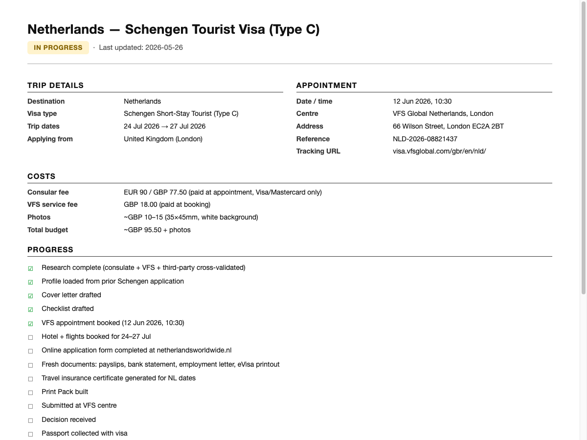</p>

Tracks every stage of your application: research, appointment booking, document assembly, submission, and outcome. Come back days or weeks later and the skill resumes from this file instead of making you explain everything again. Status badges update automatically — from **IN PROGRESS** through **SUBMITTED** to **GRANTED** or **REFUSED**.

<p align="center">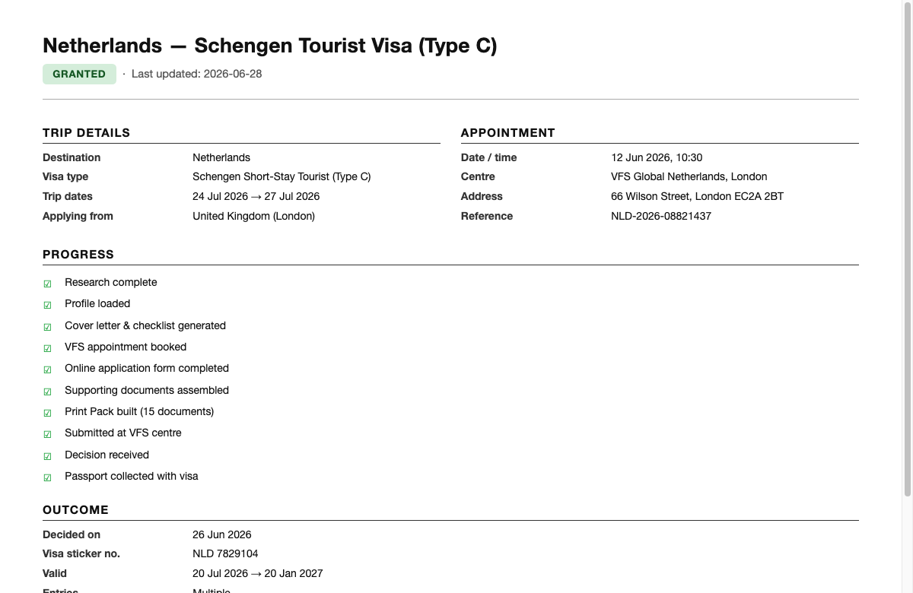</p>

After approval, the visa details (sticker number, validity dates, entries) are captured and saved to your reusable profile, so the next Schengen application can auto-fill the "previous visas in the last 3 years" question.
</details>

<details>
<summary><b>Appointment-Day Checklist</b> — what to check before you leave home</summary>
<br>
<p align="center">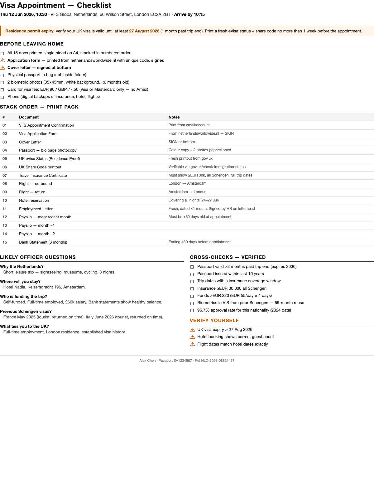</p>

Prints as file `00`, the cover sheet of your Print Pack. It tells you:

- **Before leaving home** — what to sign, what to bring, and which card to carry
- **Stack order** — the exact document order to keep in your folder
- **Likely officer questions** — with suggested answers drawn from your actual documents
- **Cross-checks verified** — passport validity, insurance coverage, fund minimums
- **Verify yourself** — items the skill cannot confirm (UK visa expiry, hotel guest counts)
- **Warning banners** — critical risks such as residence permit expiry timing
</details>

<details>
<summary><b>Cover Letter</b> — one page, formal, ready to sign</summary>
<br>
<p align="center">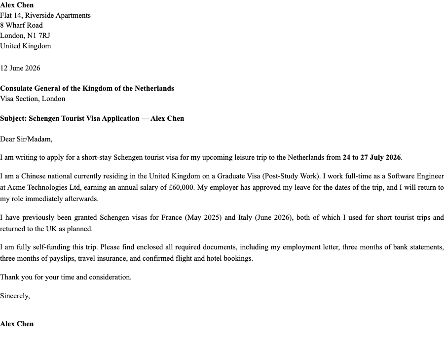</p>

Addressed to the correct consulate, with your employment details, trip dates, prior visa history, and a clean summary of the evidence enclosed. It is generated from your profile, so you review it, sign it, and move on.
</details>

<details>
<summary><b>Print Pack</b> — numbered, ordered, print-and-go</summary>

```
Print Pack/
├── 00 - CHECKLIST.pdf
├── 01 - VFS Appointment Confirmation.pdf
├── 02 - Visa Application Form - SIGN.pdf
├── 03 - Cover Letter - SIGN.pdf
├── 04 - Passport - Bio Page (photocopy).pdf
├── 05 - UK Immigration Status (eVisa).pdf
├── 06 - UK Share Code.pdf
├── 07 - Travel Insurance Certificate.pdf
├── 08 - Flight - Outbound.pdf
├── 09 - Flight - Return.pdf
├── 10 - Hotel Reservation.pdf
├── 11 - Employment Letter (signed).pdf
├── 12 - Payslip - Month 1.pdf
├── 13 - Payslip - Month 2.pdf
├── 14 - Payslip - Month 3.pdf
└── 15 - Bank Statement (3 months).pdf
```

Print every file single-sided on A4 and keep the numbered order. No more guessing what goes first.
</details>

### How it works

The skill follows a **9-phase workflow** so the application moves from vague idea to appointment-ready pack without skipping the boring but important checks:

| Phase | What happens |
|-------|-------------|
| **0. Search** | Finds your existing profile and any previous application folders on disk |
| **1. Ask** | Asks only the details it needs — cold start (4 questions) or warm start (resume, new application, or profile update) |
| **2. Profile** | Reads your passport, payslips, and bank statements — you drop files, it extracts the data |
| **3. Folder** | Locates or creates the application folder (iCloud Drive, Documents, Desktop, or custom) |
| **4. Research** | Checks the consulate page, the visa-centre operator, and a third-party guide. Cross-validates the rules and flags disagreements. |
| **5. Appointment** | Books or records the VFS/TLScontact appointment. Checks timing against processing windows and document freshness. |
| **6. Documents** | Generates the cover letter and employment-letter draft, fills the application form (portal → interactive PDF → vision overlay → manual fallback), and assembles the Print Pack |
| **7. Cross-check** | Produces the final report: document manifest, compliance checks, and next steps. Written to `application_status.html` so you can resume later. |
| **8. Post-submission** | Tracks status, captures approved visa details in the reusable profile, and handles refusals or appeals |

### Demo

```
You:    I need a Schengen visa to the Netherlands from the UK, late July.

Skill:  [structured questions for dates and details]

You:    24th to 27th.

Skill:  Got it — Netherlands Schengen tourist visa, 4 days, applying from London.
        I found the profile from your last application.
        Checking netherlandsworldwide.nl, VFS Global UK,
        and Wise 2026 guide…

        Confirmed from multiple sources: EUR 90 fee + GBP 18 VFS service fee,
        EUR 30k insurance, 35×45mm photo, online form mandatory from 1 Jun 2026,
        15–21-day processing, and 59-month biometric reuse from your France 2025
        capture.

        [books the appointment through VFS Global]

        Generating cover letter, checklist, application status tracker…
        Assembling the Print Pack (15 documents).

        Check: your UK Graduate Visa must be valid until at least
        27 Aug 2026 (1 month past trip end) — verify via UKVI account.

You:    [prints, signs, walks in]

        (… 2 weeks later …)

You:    Visa granted — here's the sticker.

Skill:  Captured: NLD 7829104, valid 20 Jul → 20 Jan 2027, multiple
        entries, 90 days. Saved to `visa_history` — the next Schengen
        application auto-fills "previous visas in last 3 years".
```

**First visa: about 45 minutes. The next one: about 10 minutes.**

### Key features

- **Reusable profile** at `~/.claude/visa-profile.json` — passport, address, employer, banking, and visa history. Build it once from your documents, then reuse it for every future application.
- **Cross-validated research** — consulate page first, visa-centre operator second, third-party guide third. Every important rule needs at least two sources, with URLs and access dates cited.
- **Smart form filling** — 4-tier strategy: online portal (with 2D barcode), interactive PDF fields, vision-driven coordinate overlay, and manual data sheet as the last resort. The skill fills the form itself; asking you to do it by hand is the fallback, not the default.
- **Multi-session continuity** — `application_status.html` tracks progress. Come back days later and the skill resumes at the first incomplete phase.
- **Document intake** — drop a file and get structured data back. Passport scan → name, number, expiry. Payslip → salary, employer, NI number. Hotel PDF → dates, address, guest count. The skill cross-checks everything against your profile.
- **Timing intelligence** — warns about stale documents, processing time vs trip date, peak-season backlogs, passport expiry traps, insurance date gaps.
- **Questionnaire forms** — when the skill needs 4+ answers (DS-160 fields, family details, travel history), it generates an interactive HTML form you fill in your browser — not a chat wall of questions.
- **Dual output** — every generated document is both HTML (browser-viewable) and PDF (print-ready). User-provided uploads stay in their original format.

### Adapts to your language

User-facing documents (checklist, status tracker) are generated in whatever language you use. Application-facing documents (cover letter, visa form) stay in the language the consulate expects.

| Status tracker | Appointment checklist |
|---|---|
| 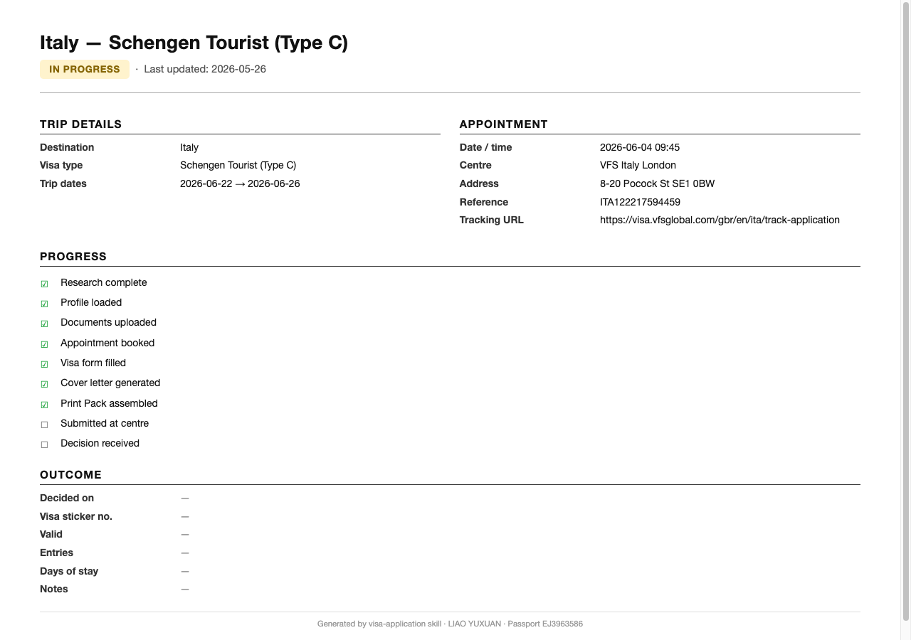 | 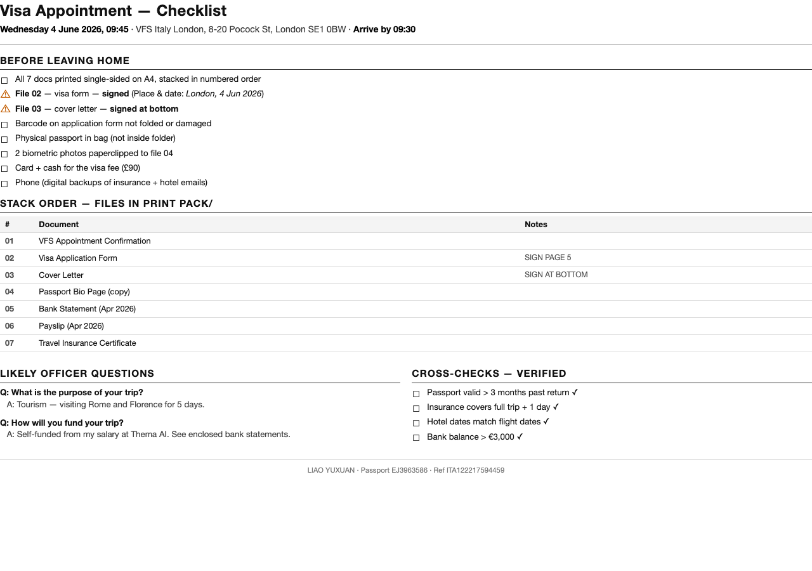 |
| 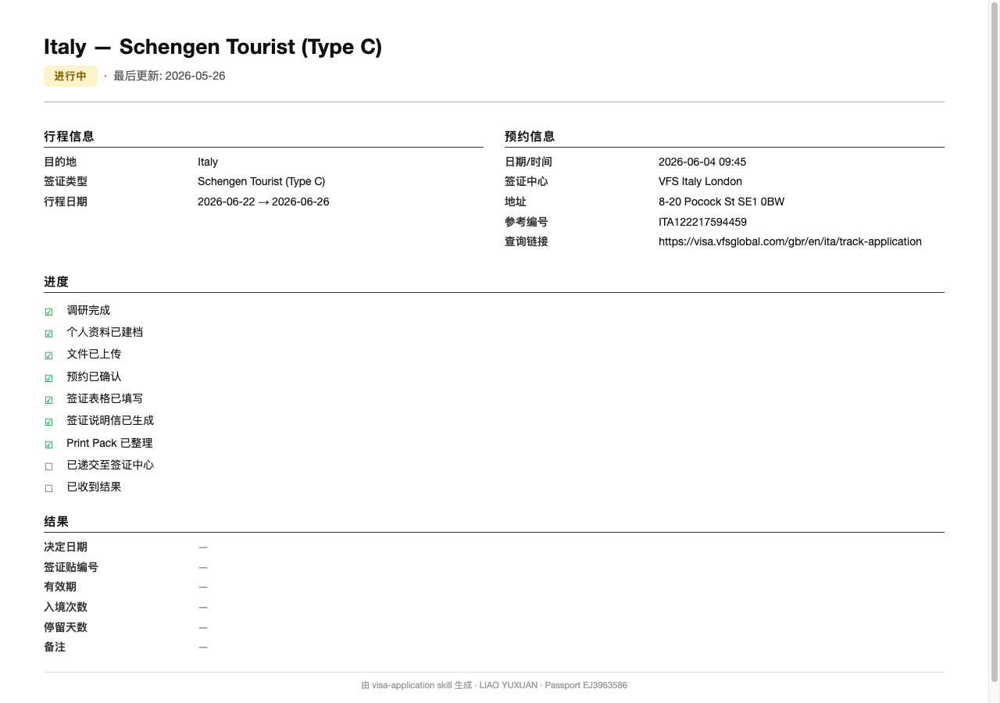 | 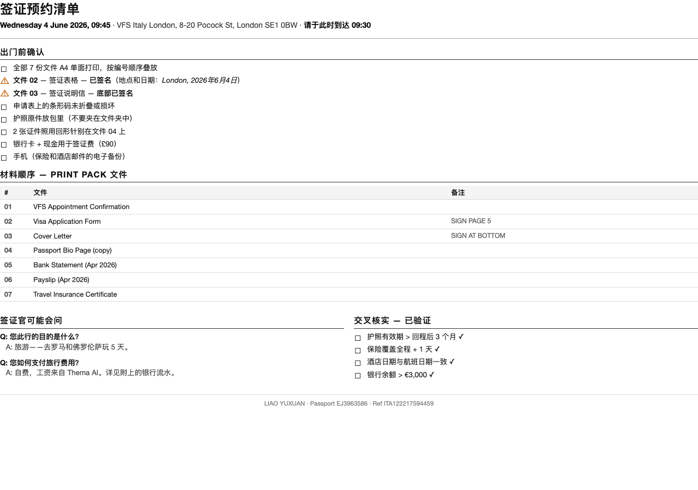 |
| 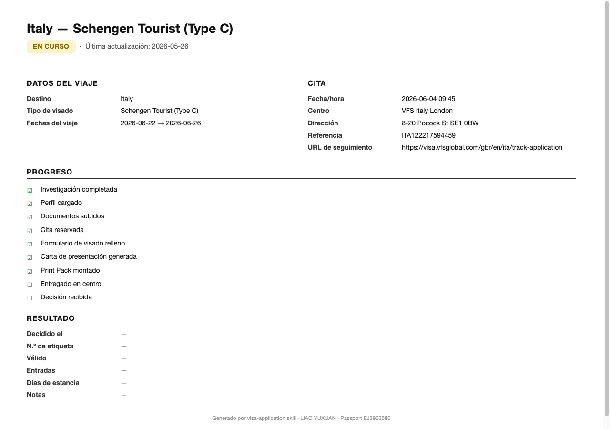 | 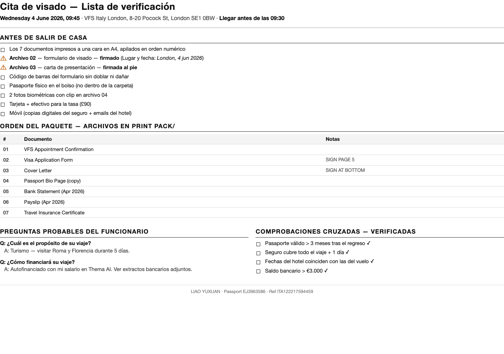 |
| 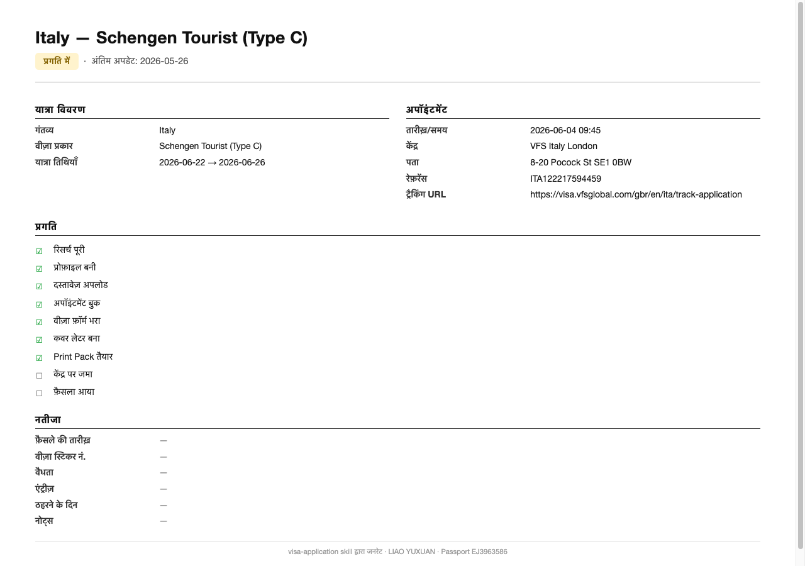 | 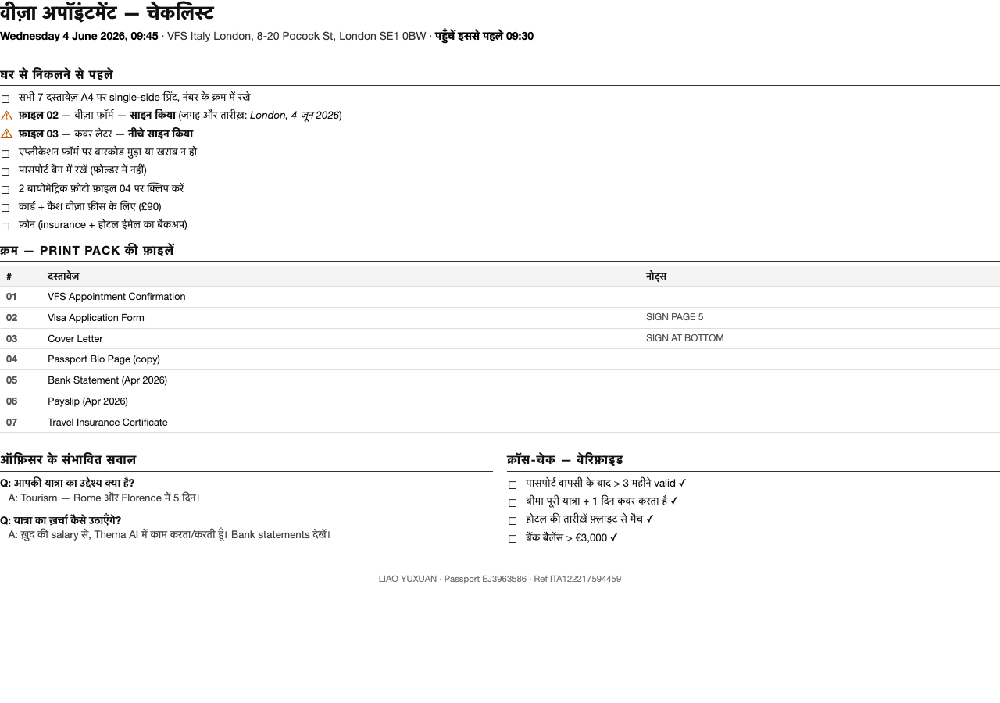 |

### Install

**Plugin install (recommended):**

```
/plugin marketplace add Shadowhusky/visa-application
/plugin install visa-application@shadowhusky
```

That's it. The skill is available immediately — mention a visa in any Claude Code session.

**Manual install (alternative):**

```bash
# macOS / Linux / WSL / Git Bash
mkdir -p ~/.claude/skills
git clone https://github.com/Shadowhusky/visa-application.git ~/.claude/skills/visa-application
```

```powershell
# Windows PowerShell
New-Item -ItemType Directory -Force -Path "$HOME\.claude\skills" | Out-Null
git clone https://github.com/Shadowhusky/visa-application.git "$HOME\.claude\skills\visa-application"
```

No git, or running into an issue? See [INSTALL.md](INSTALL.md) for ZIP download instructions, verification steps, and troubleshooting for corporate proxies, paths with spaces, `/skills` not showing the skill, and more.

Then mention a visa in any Claude Code session. The skill takes over from there.

### Coverage

Schengen (all 27 countries), US B1/B2, UK Visitor, Japan, Canada, China, Australia — any country with a documented visa process. Country-specific quirks are handled: VFS vs TLScontact routing, online portal detection, biometric reuse rules, and EES border procedures.

### What it won't do

- Asylum, family reunification, or anything that needs a qualified immigration lawyer
- Enter payment card details — the skill always stops at the payment step
- Make promises about visa outcomes — it helps assemble a strong file, not a guarantee
- Store your data remotely — everything is local files on your machine

### Privacy

Profile data is **local only** and is never transmitted. Application folders default to `~/Documents/Visa Applications/{Country}-{Year}/` or iCloud Drive. The skill reads your documents to extract data, but it does not send them anywhere.

### File structure

```
visa-application/
├── SKILL.md                    ← the 9-phase workflow (what Claude reads)
├── README.md                   ← this file
├── INSTALL.md                  ← installation & troubleshooting
├── LICENSE                     ← MIT
├── references/
│   ├── research-protocol.md    ← how to research and cross-validate sources
│   ├── document-checklist.md   ← standard document lists by visa type
│   ├── known-portals.md        ← online application portals, booking URLs, country quirks
│   ├── profile-schema.md       ← visa-profile.json schema
│   ├── form-filling-strategy.md ← 4-tier strategy for filling application forms
│   └── visa-scenarios.md       ← renewal, family, business, transit, student, refusal/appeal
├── templates/
│   ├── cover-letter.html       ← cover letter, A4 single page
│   ├── employment-letter.html  ← employment letter, A4 single page
│   ├── checklist.html          ← Print Pack cover-sheet checklist
│   ├── application-status.html ← application status tracker
│   ├── form-data.html          ← Tier 4 manual-transcription data sheet
│   └── questionnaire.html      ← interactive HTML form for bulk data collection
├── scripts/
│   ├── render-pdf.sh           ← HTML → PDF via Chrome headless
│   ├── find-existing.sh        ← search for existing profile / application folders
│   └── build-print-pack.sh     ← assemble the numbered Print Pack
├── assets/                     ← banner, icons, demo screenshots
└── tests/
    ├── smoke-test.sh           ← structural sanity check
    └── scenarios.md            ← 11 end-to-end behavioural scenarios
```

### License

MIT.

---

<a id="中文"></a>
## 中文

办签证最烦的不是填表，是不知道材料到底齐不齐。

这个 Claude Code 技能会帮你把「我要办签证」整理成一套可以直接打印、签字、带去递交的完整材料包。

### 为什么

签证真的很容易被小细节卡住：攻略过期、官网难找、材料清单说法不一致、酒店订单人数不对、保险日期差一天。最烦的是，漏一份材料可能就要重新约时间。

它会帮你查当前规则、整理材料、生成说明信和清单，并把所有文件按受理人员的查看顺序排好。你只需要处理必须本人完成的部分：订机票、拍照、签字、付款。

### 产出物

你会得到一个独立申请文件夹，里面有可预览的 HTML、可直接打印的 PDF，以及已经编号排好顺序的 Print Pack。

<details>
<summary><b>申请状态跟踪页</b> —— 下次回来不用重新说一遍</summary>
<br>
<p align="center"></p>

它会记录申请进度、预约信息、费用、材料状态和下一步。几天或几周后再回来，技能会直接从这个文件继续，不需要你重新解释。状态会从 <b>IN PROGRESS</b> 自动推进到 <b>SUBMITTED</b>，最后更新为 <b>GRANTED</b> 或 <b>REFUSED</b>。

<p align="center"></p>
</details>

<details>
<summary><b>预约当天清单</b> —— 出门前照着看就行</summary>
<br>
<p align="center"></p>

这一页会放在材料包最前面。出门前要签哪里、带什么卡、材料怎么排、受理人员可能问什么、哪些地方还需要你本人确认，都写清楚。
</details>

<details>
<summary><b>签证说明信</b> —— 正式、清楚、可以直接签</summary>
<br>
<p align="center"></p>
</details>

### 工作流程

流程会按 **9 个阶段**推进：搜索旧资料 → 提问 → 建个人资料 → 创建申请文件夹 → 核查签证要求 → 预约 → 生成文档 → 交叉检查 → 提交后跟踪。

**第一次大约 45 分钟。以后再办同类签证，大约 10 分钟就能复用资料。**

### 核心功能

- **个人资料可复用**：护照、地址、雇主、银行信息、签证历史都会保存在 `~/.claude/visa-profile.json`，下次申请不用重填。
- **规则会交叉核对**：领事馆官网、签证中心官网、第三方指南一起看，关键要求至少两个来源确认。
- **表格尽量自动填**：优先走在线门户，其次可填写 PDF，再到视觉定位叠加；手动填写只是最后兜底。
- **中断也不怕**：`application_status.html` 会记录进度，今天没做完，过几天回来还能接着做。
- **文件直接读取**：护照扫描件、工资单、银行流水、酒店订单都可以拖进去，自动提取信息并交叉检查。
- **提前提醒风险**：材料过期、处理时间太紧、旺季积压、护照有效期不够，都会提前标出来。

### 安装

**插件安装（推荐）：**

```
/plugin marketplace add Shadowhusky/visa-application
/plugin install visa-application@shadowhusky
```

装好后在任何 Claude Code 会话里提到签证，它就会开始接手。

**手动安装：**

```bash
mkdir -p ~/.claude/skills
git clone https://github.com/Shadowhusky/visa-application.git ~/.claude/skills/visa-application
```

更多安装方式见 [INSTALL.md](INSTALL.md)。

### 覆盖范围

申根（全部 27 国）、美国 B1/B2、英国访客签证、日本、加拿大、中国、澳大利亚都可以。只要签证流程是公开可查的，它就能按当前规则帮你整理。

### 隐私

个人资料只保存在本地，不会外传。

### 许可

MIT。

---

<a id="español"></a>
## Español

Una habilidad de Claude Code para llegar a la cita del visado con todo impreso, firmado y en el orden correcto.

### Por qué

En una solicitud de visado, un detalle pequeño puede costarte semanas. Los requisitos cambian, muchas guías se quedan desactualizadas y la página oficial del consulado a menudo está escondida, desactualizada o ambas cosas. Si falta un documento, puede que tengas que esperar otro mes para conseguir una nueva cita.

Esta herramienta convierte ese caos en un flujo claro: revisa los requisitos actuales, genera los documentos, ordena el Print Pack y marca lo que aún debes comprobar. Tú te ocupas de vuelos, fotos, firmas y pagos; ella se encarga del papeleo.

### Qué produce

Terminas con una carpeta completa para la solicitud: borradores en HTML para revisar en el navegador, PDF listos para imprimir y un Print Pack numerado en el orden en que probablemente lo revisará el funcionario.

<details>
<summary><b>Seguimiento del estado de la solicitud</b></summary>
<br>
<p align="center"></p>
<p align="center"></p>
</details>

<details>
<summary><b>Checklist para el día de la cita</b></summary>
<br>
<p align="center"></p>
</details>

<details>
<summary><b>Carta de presentación</b></summary>
<br>
<p align="center"></p>
</details>

**Primer visado: unos 45 minutos. Los siguientes: unos 10 minutos cada uno.**

### Instalación

**Instalar como plugin (recomendado):**

```
/plugin marketplace add Shadowhusky/visa-application
/plugin install visa-application@shadowhusky
```

Listo. Menciona un visado en cualquier sesión de Claude Code y el skill se activa.

**Instalación manual:**

```bash
mkdir -p ~/.claude/skills
git clone https://github.com/Shadowhusky/visa-application.git ~/.claude/skills/visa-application
```

Más opciones en [INSTALL.md](INSTALL.md).

### Cobertura

Schengen (los 27 países), EE. UU. B1/B2, UK Visitor, Japón, Canadá, China, Australia — cualquier país con un proceso de visado documentado.

### Privacidad

El perfil se guarda solo en tu equipo y nunca se transmite. Por defecto, las carpetas de solicitud se crean en `~/Documents/Visa Applications/{País}-{Año}/`.

### Licencia

MIT.

---

<a id="हिन्दी"></a>
## हिन्दी

यह Claude Code skill उन लोगों के लिए है जिन्हें वीज़ा अपॉइंटमेंट पर ले जाने के लिए प्रिंटेड, साइन किया हुआ और सही क्रम में रखा दस्तावेज़ पैक चाहिए।

### क्यों

वीज़ा आवेदन में छोटी गलती भी बड़ी देरी करा सकती है। नियम बदलते रहते हैं, कई ऑनलाइन गाइड पुरानी जानकारी दोहराते हैं, और कॉन्सुलेट की आधिकारिक वेबसाइट अक्सर छिपी हुई, पुरानी, या दोनों होती है। एक दस्तावेज़ छूट जाए, तो नई अपॉइंटमेंट के लिए एक महीना और इंतज़ार करना पड़ सकता है।

यह skill ताज़ा नियमों की जाँच करती है, दस्तावेज़ बनाती है, Print Pack को सही क्रम में रखती है और जिन चीज़ों पर आपका ध्यान चाहिए उन्हें अलग से दिखाती है। आप फ़्लाइट, फ़ोटो, हस्ताक्षर और भुगतान संभालते हैं; कागज़ी काम यह संभाल लेती है।

### यह क्या बनाती है

हर आवेदन के लिए पूरा फ़ोल्डर बनता है: ब्राउज़र में देखे जा सकने वाले HTML ड्राफ्ट, प्रिंट के लिए तैयार PDF, और अधिकारी की जाँच के क्रम में नंबर किया हुआ Print Pack।

<details>
<summary><b>आवेदन की स्थिति ट्रैक करने वाला पेज</b></summary>
<br>
<p align="center"></p>
<p align="center"></p>
</details>

<details>
<summary><b>अपॉइंटमेंट वाले दिन की चेकलिस्ट</b></summary>
<br>
<p align="center"></p>
</details>

<details>
<summary><b>कवर लेटर</b></summary>
<br>
<p align="center"></p>
</details>

**पहला वीज़ा: ~45 मिनट। उसके बाद हर वीज़ा: लगभग 10 मिनट।**

### इंस्टॉल करें

**Plugin से install करें (recommended):**

```
/plugin marketplace add Shadowhusky/visa-application
/plugin install visa-application@shadowhusky
```

बस, हो गया। किसी भी Claude Code session में वीज़ा का ज़िक्र करें और skill activate हो जाएगी।

**Manual install:**

```bash
mkdir -p ~/.claude/skills
git clone https://github.com/Shadowhusky/visa-application.git ~/.claude/skills/visa-application
```

और विकल्पों के लिए [INSTALL.md](INSTALL.md) देखें।

### किन देशों के लिए

Schengen (सभी 27 देश), US B1/B2, UK Visitor, जापान, कनाडा, चीन, ऑस्ट्रेलिया — यानी कोई भी देश जिसकी वीज़ा प्रक्रिया दस्तावेज़ित हो।

### गोपनीयता

प्रोफ़ाइल सिर्फ़ आपके कंप्यूटर पर रहती है; इसे कहीं भेजा नहीं जाता। आवेदन फ़ोल्डर डिफ़ॉल्ट रूप से `~/Documents/Visa Applications/{Country}-{Year}/` में बनते हैं।

### लाइसेंस

MIT।
